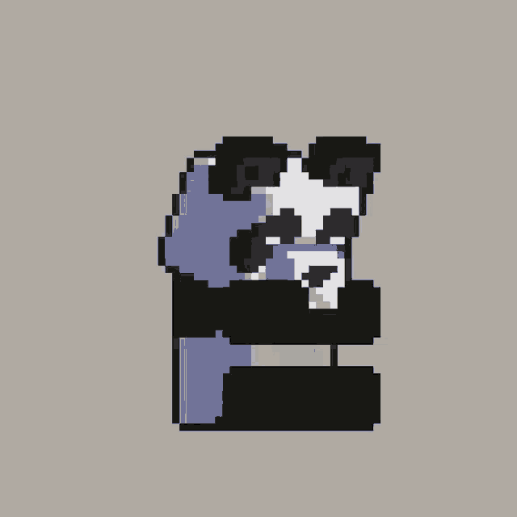

 

   <h2><b> Minecraft feito em sala usando python para apresentação </b></h2> ㅤ> Created on 01/03/2023   ㅤ> @author: Luis Gustavo Caris dos Santos   ㅤ> <code>pip install Ursina</code> para usar  

<h3>Explicação:</h3>

| FUNÇÕES | EXPLICAÇÃO |
|----|----|
| Voxel(textura, posicao) | Gera o bloco na posição informada - por padrão `posicao` = (0, 0, 0)
| Voxel().input(key) | Se `key` == "right mouse down": - posiciona o bloco selecionado   Se `key` == "left mouse down" - Destroy o bloco que está no centro da visão|
| GerarEstrutura().lerArquivo(arquivo) | Interpreta um .txt da pasta `bases` com informações sobre um estrutura |
| GerarEstrutura().criarEstrutura(arquivo, position) | Controi uma estrutura: - `arquivo` = .txt que ira passar para `.lerArquivo(arquivo)` - `position` = coordenadas base do mundo para contruir a estrutura |
| update() | Função chama a cada frame |
| Slots().atualizar_slot() | Identifica o slot de itens selecionado |
| mao.active() | Atualiza a posição da mão para frente |
| mao.passive() | Volta a posição da mão para o padrão |

